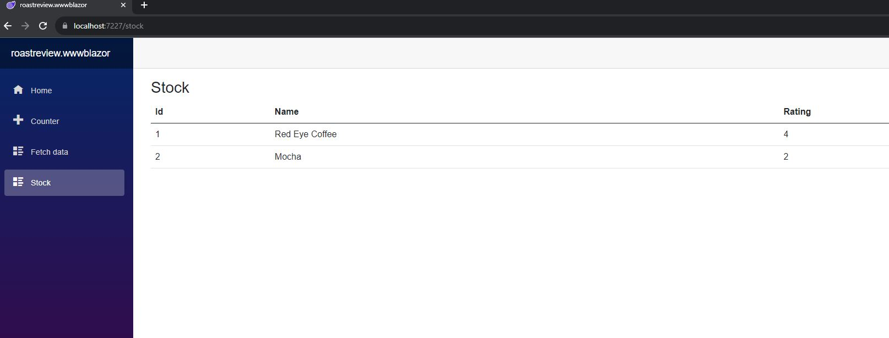

# C# Tech Clinic Introduction to C#
# Roast Review Application

## Part One
## Learning Objectives
- Understand the .Net Solution/Project layout
- dotnet command to quickly create solution and projects
- dotnet new sln --name roastreview
- dotnet new classlib --name roastreview.data
- dotnet new classlib --name roastreview.models
- dotnet new blazorwasm --name roastreview.wwwblazor
- dotnet new nunit --name roastreview.tests
- dotnet new wpf --name roastreview.windowsui
- dotnet sln add **/*.csproj

- Build a  web application that consumes a data layer.

## Part Two
## Learning Objectives TBC

## Set up instructions
- Fork this repository and clone the forked version to your machine
- Open the solution file in Visual Studio.

